```{r setup, include = FALSE}
knitr::knit_hooks$set(crop = knitr::hook_pdfcrop)

knitr::opts_chunk$set(
  echo = FALSE,
  warning = FALSE,
  message = FALSE,
  cache = TRUE,
  autodep = TRUE,
  dev = "png",
  fig.retina = 2,
  fig.width = 4.5,
  fig.height = 4,
  fig.align = "center",
  dev.args = list(pointsize = 16),
  crop = TRUE
)

library(tidyverse)
library(kableExtra)
library(ggthemes)
library(patchwork)

kable <- function(x, ...) {
  knitr::kable(x, escape = FALSE, linesep = "", booktabs = TRUE)
}

library(RefManageR)
BibOptions(
  check.entries = FALSE,
  bib.style = "authoryear",
  style = "markdown",
  dashed = TRUE
)
bib <- ReadBib("assets/stae04.bib")

if (!interactive()) {
  theme_set(theme_grey(base_size = 16))
}

theme_set(theme_grey(base_size = 16))

options(digits = 3)
```

class: section-title

# Datavisualisering

---

## Vem är jag?

- Doktorand på Statistiska institutionen.

--

- Lärare på kursen **STAE04: Visualisering av data**

--

- Utvecklare av mjukvara för bland annat datavisualisering

--

- [larssonjohan.com](https://larssonjohan.com), <johan.larsson@stat.lu.se>

.pull-right60[
  ```{r}
  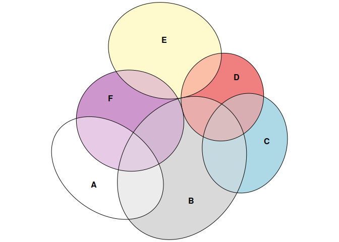
  ```
]

---

## Varför använda datavisualisering?

- utforska
- kommunicera
- berätta en "story"

Med **visualisering** utnyttjar vi vår välutvecklade synförmåga!

```{r out.width = "70%"}
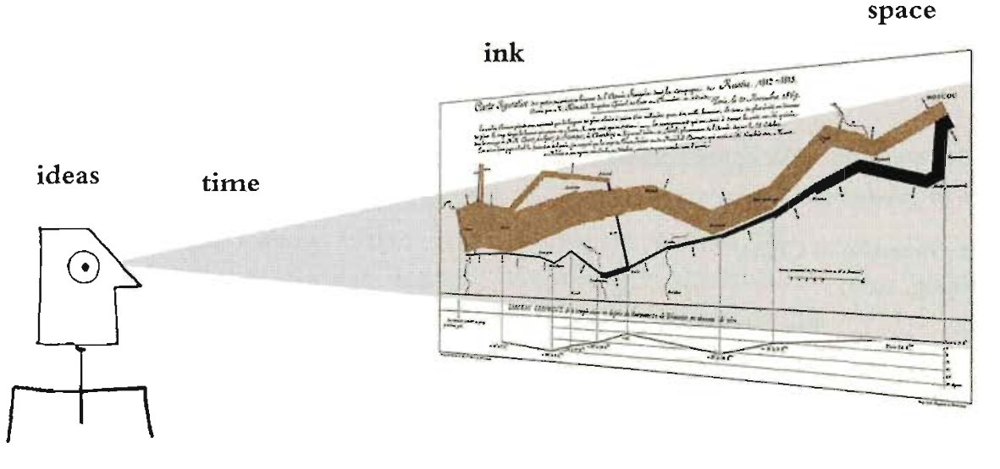
```

---

class: middle

```{r, fig.cap = "Charles Minards visualisering över Napoleons krig i Ryssland 1812.", out.height = "37%"}
knitr::include_graphics("images/napoleon.png")
```

---

class: center, middle

.pull-left[
```{r}
swe_employment <- readRDS("data/swe_employment.rds")

tmp <- select(swe_employment, region, employment)
tmp[!duplicated(tmp), ] %>%
  as_tibble() %>%
  arrange(desc(employment)) %>%
  rename("sysselsättning (%)" = employment) %>%
  kable() %>%
  kable_styling(font_size = 12)
```
]

--

class: center, middle

.pull-right[

```{r, fig.width = 5, fig.height = 6}
ggplot(swe_employment, aes(long, lat, group = region, fill = employment)) +
  geom_polygon() +
  scale_fill_continuous(name = "sysselsättning (%)") +
  coord_equal() +
  theme_void()
```
]

---

class: middle

```{r fig.cap = "Röstmönster och stöd för vinnaren i valet."}
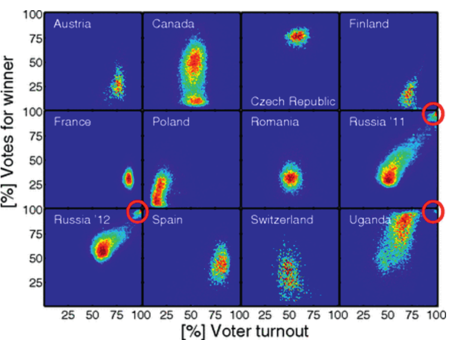
```

---

class: section-title

# Datavisualiseringens anatomi

---

## Data

Vi vill visualisera ett dataset om sömn och hjärnstorlek hos däggdjur.

Variablerna vi har är

- den genomsnittliga mängden sömn (numeriskt),
- storleken på djurets hjärna (numeriskt), och
- kosthållning (kategoriskt).

---

## Kanvas

```{r, fig.width = 8, fig.height = 6}
ggplot(msleep)
```

---

## Rutnät (Grid)

```{r, fig.width = 8, fig.height = 6}
p <-
  msleep %>%
  mutate(vore = recode(vore,
                       "carni" = "karnivor",
                       "herbi" = "herbivor",
                       "insecti" = "insektivor",
                       "omni" = "omnivor")) %>%
  drop_na(sleep_total, vore, brainwt) %>%
  ggplot(aes(brainwt, sleep_total, col = vore)) +
  labs(y = "Sömn (timmar)", x = "Hjärnvikt (kg)",
       col = "Kosthållning") +
  scale_x_log10(
   breaks = scales::trans_breaks("log10", function(x) 10^x),
   labels = scales::trans_format("log10", scales::math_format(10^.x))
  ) +
  scale_color_colorblind()
p +
  theme(legend.pos = "none",
        axis.title = element_blank(),
        axis.ticks = element_blank(),
        axis.text = element_blank())
```

---

## Geometri (Geoms)

```{r, fig.width = 8, fig.height = 6}
p +
  geom_point() +
  scale_color_colorblind() +
  theme(legend.pos = "none",
        axis.title = element_blank(),
        axis.ticks = element_blank(),
        axis.text = element_blank())
```

---

## Hjälpredor (Guides)

```{r fig.width = 10, fig.height = 6.5}
p +
  geom_point()
```

---

## En beskrivning (Caption)

```{r, fig.height = 6.5, fig.width = 10, fig.cap = "Sömnlängd och hjärnstorlek för en uppsättning däggdjur."}
p +
  geom_point()
```

---

class: section-title

# Principer för effektiva datavisualiseringar

---

## Edward Tuftes principer

* Above all else show the data.

--

* Maximize the data-ink ratio.

--

* Erase non-data ink.

--

* Erase redundant data-ink.

--

* Revise and edit. `r Citep(bib, "tufte2001")`

.pull-right[
```{r, out.width = "80%", echo = FALSE}
knitr::include_graphics("images/tufte.png")
```
]

---

## Above all else show the data

* Data är i verkligheten alltid **multivariat**.

--

* Det är ofta **fördelningen** av data som är intressant.

--

* Framförallt vill vi kunna se hur olika variabler **samvarierar**.

--

* **Aggregera** inte data i onödan!

--

.pull-left[
### Ett okänt datamaterial

Anta att vi har fått ett datamaterial med 142 observationer
på två variabler (mått) i knät: `x` och `y`
och ska analysera dessa.
]

--

.pull-right[
```{r}
library(tidyverse)
library(datasauRus)

xy <- datasaurus_dozen %>%
  filter(dataset == "dino") %>%
  select(-dataset)

xy_long <-
  xy %>%
  pivot_longer(everything(), names_to  = "variabel", values_to = "värde")

xy_long %>%
  group_by(variabel) %>%
  summarize(medelvärde = mean(värde)) %>%
  ggplot(aes(variabel, medelvärde)) +
    geom_col()
```
]

---

class: middle

.pull-left[
```{r, out.width = "100%"}
knitr::include_graphics("images/vangogh.jpg")
```
]

--

.pull-right[
```{r, fig.width = 5, fig.height = 3.98, out.width = "100%", crop = NULL}
library(jpeg)
vangogh <- jpeg::readJPEG("images/vangogh.jpg")

r <- mean(vangogh[, , 1])
g <- mean(vangogh[, , 2])
b <- mean(vangogh[, , 3])

par(mar = c(0, 0, 0, 0), mai = c(0, 0, 0, 0))
image(1, 1, as.matrix(1), col = rgb(r, g, b))
```

]

---

class: middle

```{r, fig.height = 7.6, fig.width = 9}
library(patchwork)

p1 <-
  ggplot(xy, aes(x)) +
  geom_histogram(bins = 20) +
  labs(y = "antal")

p2 <- ggplot(xy, aes(y)) +
  geom_histogram(bins = 20) +
  labs(y = "antal")

p1 / p2
```

---

class: middle

```{r, fig.cap = "The Datasaurus", fig.width = 8, fig.height = 6, fig.retina = 2, res = 192}
ggplot(xy, aes(x, y)) +
  geom_point()
```

---

```{r, fig.width = 4.9, fig.height = 3.6, res = 192, pointsize = 10}
library(gganimate)

ggplot(datasaurus_dozen, aes(x = x, y = y))+
  geom_point() +
  transition_states(dataset, 4, 2) +
  ease_aes('cubic-in-out') +
  theme_grey(base_size = 8)
```

---

class: center, middle

```{r, out.width = "100%"}
knitr::include_graphics("images/napoleon.png")
```

---

```{r, echo = FALSE, fig.cap = "William Playfair, The Commercial and Political Atlas (1786). Public domain.", out.width = "80%"}
knitr::include_graphics("images/playfair-england-usa.jpg")
```

---

```{r, echo = FALSE, fig.cap = "William Playfair, The Commercial and Political Atlas (1786). Public domain.", out.width = "80%"}
knitr::include_graphics("images/playfair-nordic-england.jpg")
```

---

## Maximize the Data-Ink Ratio and Erase Non-Data Ink

### Data Ink

$$
\begin{aligned}
\text{data-ink ratio}
&= \frac{\text{data-ink}}{\text{total ink used in visualization}}\\
&= 1 - \text{proportion of a graphic that can be erased}
\end{aligned}
$$

--

.pull-left[
```{r, echo = FALSE, fig.cap = "hög data-ink ratio", fig.height = 3, fig.width = 4}
mpg2 <- mutate(mpg, cyl = factor(cyl))
ticks <- pretty(1:80)

ggplot(mpg2, aes(cyl)) +
  theme_grey(base_size = 14) +
  geom_bar() +
  labs(y = "antal", x = "cylindrar")
```
]

--

.pull-right[
```{r, echo = FALSE, fig.cap = "låg data-ink ratio", fig.height = 3, fig.width = 4}
ggplot(mpg2, aes(cyl)) +
  theme_minimal(base_size = 14) +
  theme(panel.grid = element_blank()) +
  geom_bar(width = 0.5) +
  geom_hline(yintercept = ticks, col = "white", lwd = 1) +
  labs(y = "antal", x = "cylindrar")
```
]

---

## Erase Redundant Data-Ink

**redundant** data-ink: bläck som används till att visa data som redan
visas av annat bläck

--

.pull-left[
```{r, fig.cap = "mycket onödigt bläck", fig.height = 3.7, fig.width = 5}
ggplot(mpg2, aes(cyl, fill = cyl)) +
  geom_bar() +
  geom_text(aes(label = after_stat(count)),
            stat = "count",
            vjust = -1) +
  ylim(0, 90)
```
]

--

.pull-right[
```{r, fig.cap = "inget onödigt bläck", fig.height = 3.7, fig.width = 4.5}
ggplot(mpg2, aes(cyl)) +
  geom_point(stat = "count") +
  lims(y = c(0, 83))
```
]

---

## Revise and edit

en process att lyckas med en datavisualisering; sällan det första försöket
som blir slutprodukten

### GDP per capita och förväntad livslängd

säg att vi har data på

- GDP per capita
- förväntad livslängd
- land
- kontinent
- tid (år)

---

class: middle

```{r fig.width = 10, fig.height = 6}
library(gapminder)

gapminder %>%
  pivot_longer(c("lifeExp", "gdpPercap")) %>%
  ggplot(aes(year, value, colour = country)) +
    geom_line(show.legend = FALSE) +
    scale_colour_manual(values = country_colors) +
    labs(x = "år", y = NULL) +
  facet_wrap(vars(name), scales = "free_y")
```

---

class: middle

```{r fig.width = 10, fig.height = 6}
gapminder %>%
  pivot_longer(c("lifeExp", "gdpPercap")) %>%
  ggplot(aes(year, value, colour = country)) +
  geom_line(show.legend = FALSE) +
  scale_y_log10() +
  scale_colour_manual(values = country_colors) +
  facet_wrap(vars(name), scales = "free_y") +
  labs(x = "år", y = NULL)
```


---

class: middle

```{r fig.width = 10, fig.height = 7}
gapminder %>%
  mutate(year = cut(year, 9)) %>%
  ggplot(aes(gdpPercap,
             lifeExp,
             colour = country,
             group = country,
             size = pop)) +
  stat_summary(fun = "mean", geom = "point", show.legend = FALSE,
               alpha = 0.5) +
  scale_x_log10() +
  scale_colour_manual(values = country_colors) +
  facet_wrap(vars(year)) +
  xlab("förväntad livslängd (median)") +
  ylab("GDP per capita (medemvärde)")
```

---

class: middle

```{r, dev = "png", fig.height = 6, fig.width = 8, res = 192, pointsize = 10, out.width = "90%"}
library(gganimate)

ggplot(gapminder, aes(gdpPercap, lifeExp, size = pop, color = continent)) +
  ylim(20, 90) +
  geom_point(alpha = 0.6) +
  scale_size("population", limits = range(gapminder$pop)) +
  scale_x_log10(limits = range(gapminder$gdpPercap)) +
  labs(title = 'år: {frame_time}',
       x = 'GDP per capita',
       y = 'förväntad livslängd',
       fill = "kontinent") +
  theme_classic() +
  transition_time(year) +
  ease_aes()
```

---

class: section-title

# Färg

---

## Färg i datavisualiseringar

Nyckeln till att välja rätt färg är att fokusera
på datan: datanivå och innebörd

--

.pull-left[
### Sekventiell palett

```{r, echo = FALSE, fig.width = 5, fig.height = 0.5}
library(RColorBrewer)
par(mai = c(0, 0, 0, 0))
image(
  1:8,
  1,
  as.matrix(1:8),
  col = brewer.pal(8, "YlOrRd"),
  xlab = "",
  ylab = "",
  xaxt = "n",
  yaxt = "n",
  bty = "n"
)
```

värdena kan ordnas

### Kvalitativ palett

```{r, echo = FALSE, fig.width = 5, fig.height = 0.5}
par(mai = c(0, 0, 0, 0))
image(
  1:8,
  1,
  as.matrix(1:8),
  col = brewer.pal(8, "Accent"),
  xlab = "",
  ylab = "",
  xaxt = "n",
  yaxt = "n",
  bty = "n"
)
```

värdena kan **inte** ordnas
]

.pull-right[
### Divergerande palett

```{r, echo = FALSE, fig.width = 5, fig.height = 0.5}
par(mai = c(0, 0, 0, 0))
image(
  1:11,
  1,
  as.matrix(1:11),
  col = brewer.pal(11, "RdBu"),
  xlab = "",
  ylab = "",
  xaxt = "n",
  yaxt = "n",
  bty = "n"
)
```

värdena har två motpoler och en betydelsefull nollpunkt/mittvärde
]

---

## Naturliga färgkombinationer

Ibland finns det naturliga färgval att använda sig av

- politiska undersökningar
- temperatur
- geografisk data

```{r}
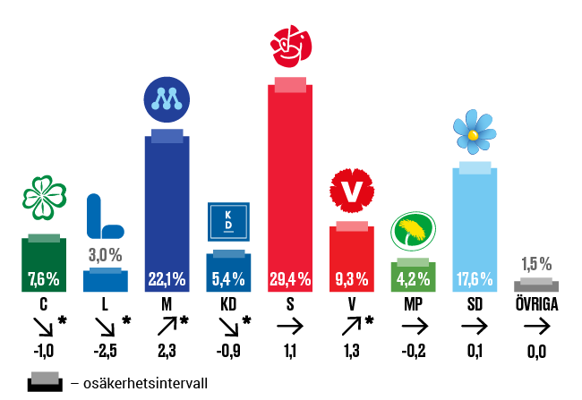
```

---

class: middle

.pull-left-70[
```{r, fig.cap = "Batymetrisk karta över Japan."}
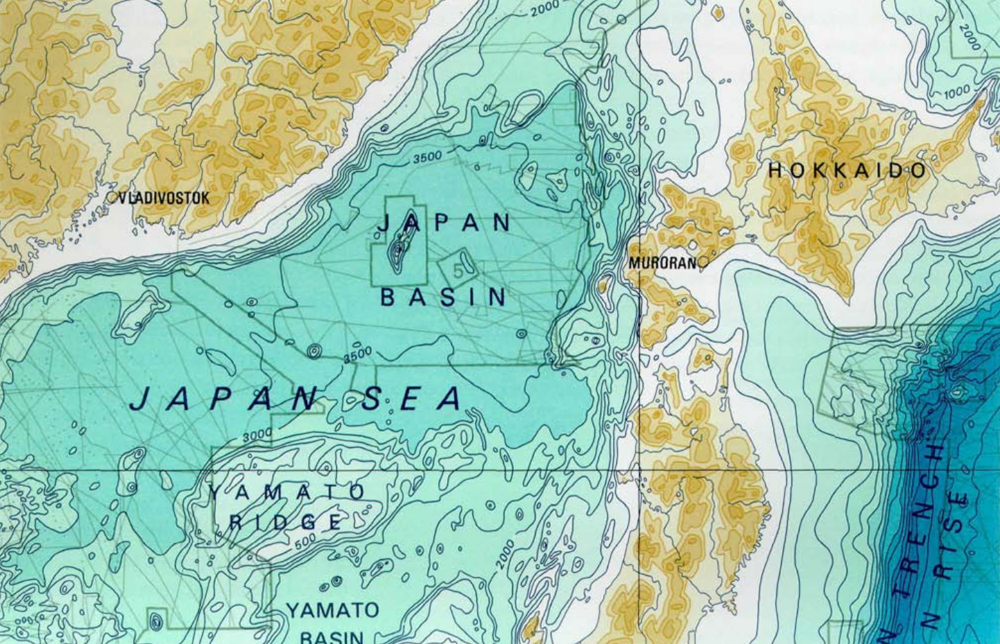
```
]

.pull-right-30[
```{r}
knitr::include_graphics("images/bathymetric-chart-legend.png")
```
]

---

## Färgblindhet

.pull-left[
8% av alla män och 0.5% av alla kvinnor lider av röd-grön färgblindhet<sup>1</sup>

många olika typer:

- protanotopia
- deuteranopia
- protanomali
- deuteranomali
- tritanopia
- tritanomali
]

.pull-right[
```{r, echo = FALSE, fig.cap = "Ishiharas färgtest. Vilket nummer ser du? (en.wikipedia.org/wiki/Color_blindness)"}
knitr::include_graphics("images/ishihara.png")
```

]

.footnote[
<sup>1</sup> Av personer av nord-europeisk härkomst.
]

---

```{r, fig.width = 11, fig.height = 8}
library(colorBlindness)

p <- ggplot(mpg, aes(hwy, fill = drv)) + geom_density(alpha = 0.5)
cvdPlot(p)
```

---

## Verktyg och resurser

### ColorBrewer

utvecklat för spatial data `r Citep(bib, "harrower2003")`, men fungerar bra
för många olika typer av data

<https://colorbrewer2.org/>

```{r, fig.height = 1, fig.width = 8}
library(RColorBrewer)
par(mai = c(0, 0, 0, 0))
image(
  1:11,
  1,
  as.matrix(1:11),
  col = brewer.pal(11, "Spectral"),
  xlab = "",
  ylab = "",
  xaxt = "n",
  yaxt = "n",
  bty = "n"
)
```

--

### Viridis

**sekventiella** paletter skapade av Stéfan van der Walt och
Nathaniel Smith

```{r, fig.height = 1, fig.width = 8}
library(viridisLite)
par(mai = c(0, 0, 0, 0))
image(
  1:8,
  1,
  as.matrix(1:8),
  col = viridis(8),
  xlab = "",
  ylab = "",
  xaxt = "n",
  yaxt = "n",
  bty = "n"
)
```

---

### Färgblindhetsvänlig palett


```{r}
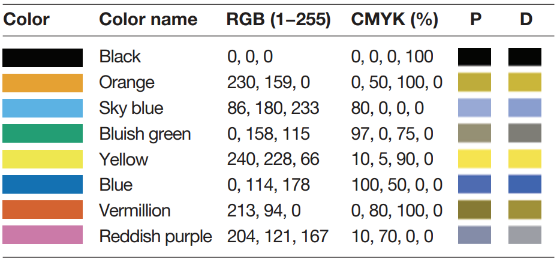
```

.right[`r Citep(bib, "wong2011a")`]

---

class: section-title

# Skalor

---

## Skalor

Valet av skalor är viktigt och bör utgå från vilken data
man har.

.pull-left[
```{r, fig.width = 5}
library(tidyverse)
library(lubridate)

bra <- tibble(
  year = ymd(2010:2019, truncated = 2),
  crime = c(1370399,
            1416280,
            1402588,
            1401982,
            1443753,
            1503399,
            1510197,
            1514902,
            1550626,
            1548406)
)

pl1 <- ggplot(bra, aes(year, crime)) +
  geom_line() +
  geom_point() +
  labs(y = "Antal brott", x = "År")
pl1
```
]

--

.pull-right[
```{r, echo = FALSE, fig.width = 5}
pl1 + ylim(c(0, max(bra$crime)*1.05))
```
]

.center[*Antal rapporterade brott i Sverige (https://www.bra.se).*]

---

## Skalor och gränsvärden

inte alltid en god idé att ta med hela skalan, till exempel när

- gränserna (till exempel 0) inte har någon särskilt innebörd,
- värdena i praktiken aldrig når ner gränserna, eller
- när även små skillnader har stor betydelse.

--

.pull-left[
```{r, fig.height = 3.7, fig.cap = "Förändringar i rapporterade brott mellan 2019 och 2020 i Serige (https://bra.se)."}
bra2 <- tibble(
  month = ymd(200001 + seq(100, 700, by = 100)),
  crime_change = c(7, 10, -4, -5, -3, 3, 6)
)

p <-
  ggplot(bra2, aes(month, crime_change)) +
  geom_point() +
  geom_linerange(aes(ymax = crime_change), ymin = 0) +
  geom_hline(yintercept = 0) +
  labs(x = "månad", y = "förändring i antal brott")
p
```
]

--

.pull-right[
```{r, fig.height = 3.7}
p + ylim(-100, 100)
```
]

---

class: middle

```{r}
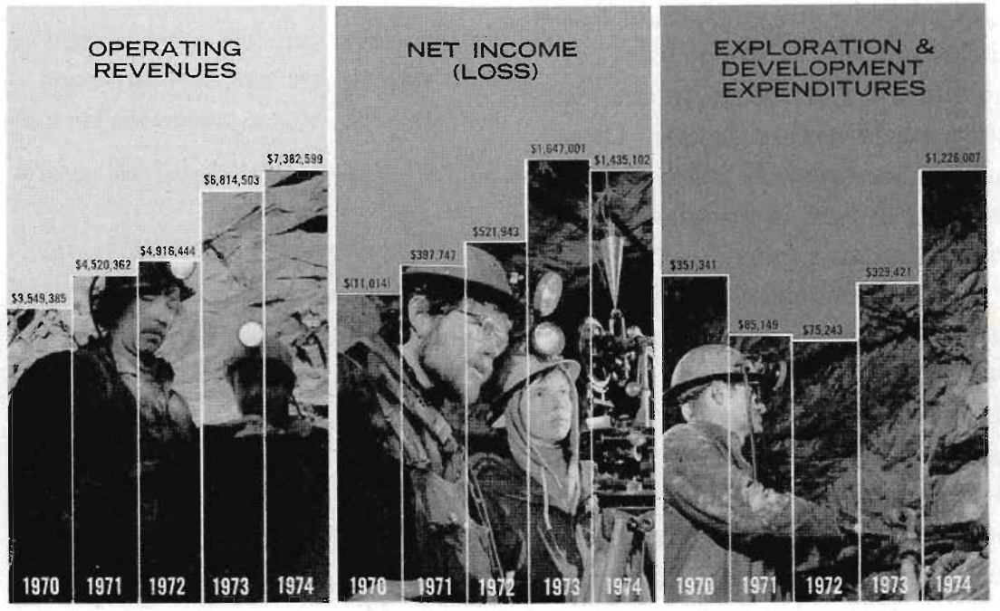
```


---

class: center, middle

```{r, fig.cap = "Förväntad livslängd i USA.", echo = FALSE, fig.width = 11, fig.height = 7}
library(maps)
library(mapproj)

arrests <-
  USArrests %>%
  rownames_to_column("state") %>%
  mutate(state = tolower(state))

states_data <-
  as.data.frame(state.x77) %>%
  rownames_to_column("State") %>%
  as_tibble() %>%
  mutate(State = tolower(State)) %>%
  filter(State != "alaska" & State != "hawaii")

states_map <- map_data("state") %>%
  filter(region != "district of columbia")

p <-
  ggplot(states_data, aes(map_id = State)) +
  geom_map(aes(fill = `Life Exp`), map = states_map) +
  expand_limits(x = states_map$long, y = states_map$lat) +
  coord_map("bonne", param = 45) +
  theme_void() +
  labs(fill = "Förväntad livslängd")
p
```

---

class: center, middle

```{r, fig.cap = "Förväntad livslängd i USA med alternativa gränsvärden.", echo = FALSE, fig.width = 11, fig.height = 7}
p + scale_fill_continuous(limits = c(66, 80))
```

---

## Storlek och area

Variabler i datan kan visualiseras med hjälp av storlek och area.

--

Var dock försiktiga: det är **svårt** att avläsa exakt; förvänta dig inte
mer än att variabeln kan läsas av som en ordinalskalevariabel

```{r}
p <- ggplot(mtcars, aes(wt, mpg, size = hp)) + geom_point()
```

```{r, fig.width = 7, fig.height = 5}
p + scale_size_area() +
  labs(x = "vikt (1000 lbs)", y = "bränslekonsumption (gallons)", size = "hästkrafter")
```

---

```{r fig.cap = "Charles Minards karta över migrationsströmmar."}
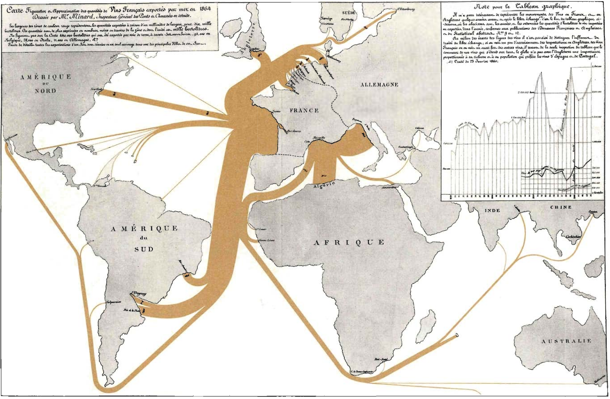
```

---

## Wordclouds

```{r fig.width = 10, fig.height = 8}
library(wordcloud2)
wordcloud2(demoFreq)
```

---

## The Lie Factor

.pull-left[
Ytterligare ett koncept introducerat att Edward Tufte

$$
\text{lie factor} = \frac{\text{effect in visualization}}{\text{size of effect in data}}
$$
]

--

.pull-right[
```{r, echo = FALSE, fig.cap = "En lie factor om 2.8.", out.width = "90%"}
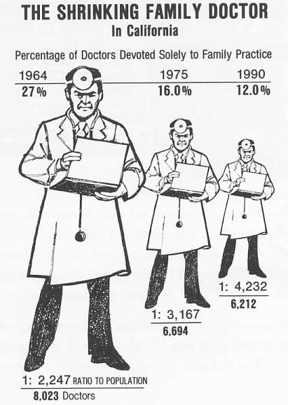
```
]

---

class: middle

```{r}
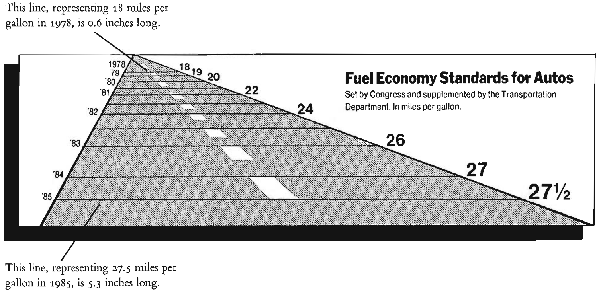
```

---

class: section-title

# Visuell perception

---

## Perspektiv (3D)

.pull-left-40[
kan verka logiskt att använda den tredje dimensionen när
man vill visualisera tre variabler

men det är sällan en god idé!
]

.pull-right-60[
```{r, echo = FALSE, fig.width = 7, fig.height = 7, dev = "png", dev.args = list(pointsize = 12), crop = TRUE, fig.cap = "Ett 3D-spridningsdiagram över data på bilar."}
library(plot3D)

with(mtcars, scatter3D(disp, hp, mpg,
                       ticktype = "detailed",
                       pch = 16,
                       col = "steelblue",
                       xlab = "motordrivning",
                       ylab = "hästkraft",
                       zlab = "bränslekonsumtion"))
```
]

---

```{r, fig.cap = "Dödstal i Virginia, USA 1940.", fig.width = 8, fig.height = 7, echo = FALSE}
library(latticeExtra)

vad <- VADeaths
colnames(vad) <- c("RM", "RF", "UM", "UF")

par.set <- list(axis.line = list(col = "transparent"),
                clip = list(panel = "off"),
                fontsize = list(text = 16, points = 10))
cloud(vad, panel.3d.cloud = panel.3dbars,
      xbase = 0.4, ybase = 0.4,
      zlab = "antal döda",
      par.settings = par.set,
      scales = list(distance = 1.5, arrows = FALSE), xlab = NULL, ylab = NULL,
      screen = list(z = 20, x = -40))
```

---

```{r out.width = "36%", fig.cap = "Antagningstal från högskolor och universitet i USA."}
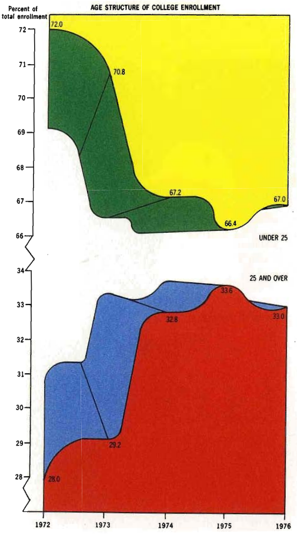
```


---

### Alla 3D-visualiseringar är inte av ondo!

Det finns situationer när man kan använda sig av 3D-visualiseringar:

1. interaktiva eller animerade visualiseringar
2. flera figurer från olika perspektiv
3. bara den övegripande trenden är viktig
4. datan representerar just de tre dimensionerna i rummet

--

```{r, echo = FALSE, fig.width = 10, fig.height = 4, fig.cap = "Topografin av Maunga Whau-vulkanen."}
p <- wireframe(volcano, panel.aspect = 0.7, zoom = 1, lwd = 0.3, col = 1,
               xlab = "", ylab = "", zlab = "",
               par.settings = list(axis.line = list(col = "transparent")))
npanel <- 3
rotz <- seq(-30, 30, length = npanel)
roty <- seq(-30, 30, length = npanel)

update(p[c(1, 1, 1)],
       layout = c(npanel, 1),
       panel = function(..., screen) {
           crow <- current.row()
           ccol <- current.column()
           panel.wireframe(..., screen = list(z = rotz[ccol],
                                              x = -60,
                                              y = 3))
       })
```

---

```{r}
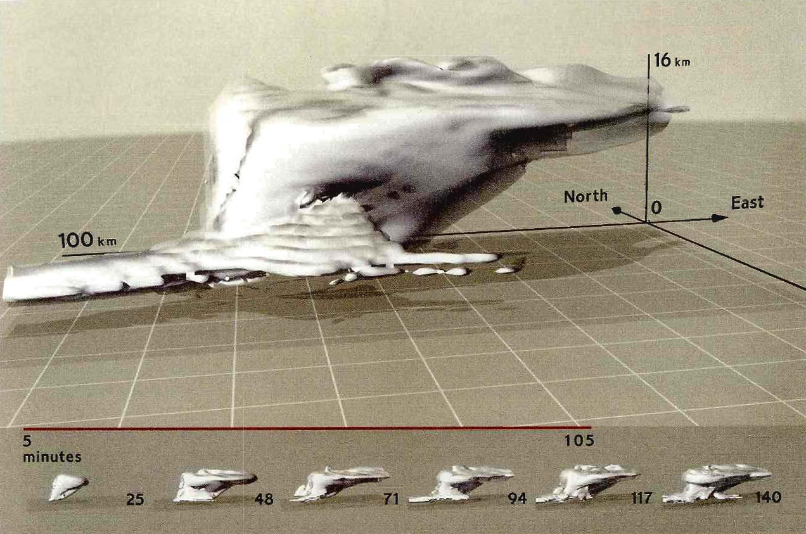
```


---

## Optiska illusioner

Vår synförmåga kan vilseleda oss!

--

```{r}
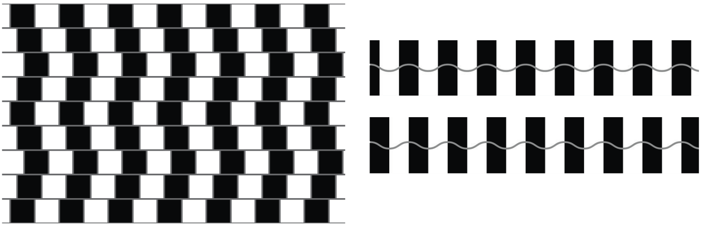
```

---

class: center, middle

```{r}
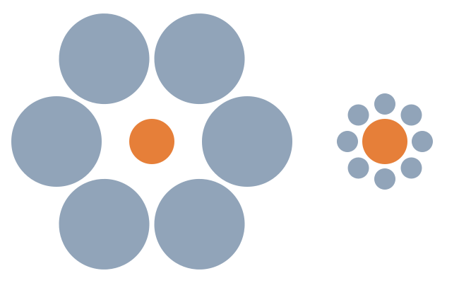
```

---

class: center, middle

```{r}
knitr::include_graphics("images/chessboard-animated.gif")
```

---

class: section-title

# Datavisualisering i praktiken

---

## Från ax till limpa

.pull-left[
### Steg 1: lär känna din data

- Vad står variablerna för?
- Hur samlades datan in?
- Vilka skalnivåer har variablerna?
- Hur många observationer har du?
- Vem är mottagaren?
- Vad vill du kommunicera?
]

--

.pull-right[
### Steg 2: utkast och skisser

- Testa olika typer av visualiseringar.
- Var beredd att kasta många utkast.
- Använd gärna papper och penna!
]

--

.pull-left[
### Steg 3: pilottesta

- Prova visualiseringen på någon i den tänkta
  mottagargruppen.
]

--

.pull-right[
### Steg 4: redigera och revidera

- Redigera och testa om.
- Behöver du göra några transformationer?
- Wax on, wax off.
]

---

## En numerisk variabel

.pull-left[
### Histogram

standardvalet om man vill visualisera fördelningen av en
numerisk variabel

```{r, fig.cap = "Histogram över utbrott av geysern Old Faithful."}
faithful %>%
  ggplot(aes(waiting)) +
  geom_histogram(bins = 15)
```
]

--

.pull-right[
### Boxplots (lådogram)

mer kompakt än histogram, men innebär större förlust av data

```{r, fig.cap = "Boxplot över utbrott av geysern Old Faithful."}
faithful %>%
  ggplot(aes(waiting)) +
  geom_boxplot()
```
]

---

## Två numeriska variabler

.pull-left[
**spridningsdiagram** är så gott som alltid det naturliga valet
```{r fig.cap = "Spridningsdiagram över fertilitet och utbilding."}
ggplot(mpg, aes(displ, cty)) +
  geom_point() +
  labs(x = "motordrivning", y = "bränsleförbrukning")
```
]

--

.pull-right[
se dock upp för överlappning i datamaterialet!
```{r fig.cap = "Spridningsdiagram över fertilitet och utbilding."}
ggplot(mpg, aes(displ, cty)) +
  geom_jitter(alpha = 0.5, width = 0.1, height = 0.1) +
  labs(x = "motordrivning", y = "bränsleförbrukning")
```
]

---

## Visualisering av kategoriska variabler

**stapeldiagram** är ofta det enklaste och mest passande valet för
data på nominalnivå
```{r}
library(productplots)

happy2006 <-
  happy %>%
  mutate(happy = factor(happy, ordered = TRUE)) %>%
  drop_na() %>%
  filter(year == 2006)
```

```{r, fig.width = 6, fig.height = 4, fig.cap = "Ett urval av variabler från en bred socialdemografisk undersökning i USA från 1972 till 2006."}
ggplot(happy2006, aes(happy)) +
  geom_bar()
```

---

### Flera kategoriska variabler

fundera på om du vill visualisera **proportioner** eller **antal**

--

.pull-left[
```{r, fig.width = 5.5, fig.height = 5.5}
ggplot(happy2006, aes(marital, fill = happy)) +
  geom_bar(position = "dodge", col = 1) +
  theme(axis.text.x = element_text(angle = 45, hjust = 1),
        legend.pos = "bottom") +
  labs(x = NULL, y = "count", fill = NULL)
```
]

--

.pull-right[
```{r, fig.width = 5.5, fig.height = 5.5}
# group_by(happy2006, marital, happy) %>%
#   summarize(prop = n())

group_by(happy2006, marital, happy) %>%
  summarize(n = n()) %>%
  mutate(prop = n / sum(n)) %>%
  ggplot(aes(marital, prop, fill = happy)) +
  geom_col(position = "dodge", col = 1) +
  theme(axis.text.x = element_text(angle = 45, hjust = 1),
        legend.pos = "bottom") +
  labs(x = NULL, y = "proportion", fill = NULL)
```
]

var dock försiktiga med proportioner när några av grupperna blir väldigt små!

---

### Uppdelade stapeldiagram

utnyttjar mycket av kanvasen men svårt att jämföra mellan kategorier

```{r fig.width = 8, fig.height = 5.5}
happy2006 %>%
  ggplot(aes(marital, fill = happy)) +
  geom_bar(position = "fill", col = 1) +
  theme(axis.text.x = element_text(angle = 45, hjust = 1)) +
  labs(x = NULL, y = "proportion", fill = NULL)
```

---

### Cirkeldiagram

fungerar enbart okej när det inte är viktigt att jämföra kategorier och när
det är få kategorier

.pull-left[
```{r fig.width = 4, fig.height = 5}
library(scales)

happy2006_sum <-
  happy2006 %>%
  group_by(degree) %>%
  summarize(n = n()) %>%
  ungroup() %>%
  mutate(perc = n/sum(n))

ggplot(happy2006_sum, aes(x = "", y = perc, fill = degree)) +
  geom_col(width = 1, col = 1) +
  coord_polar("y", start = 0) +
  scale_fill_brewer(palette = "Accent") +
  theme_minimal() +
  theme(
    axis.title = element_blank(),
    axis.text = element_blank(),
    panel.border = element_blank(),
    panel.grid = element_blank(),
    legend.pos = "bottom",
    legend.title = element_blank()
  ) +
  guides(fill = guide_legend(ncol = 3))
```
]

--

.pull-right[
```{r fig.height = 5}
ggplot(happy2006, aes(degree, fill = degree)) +
  geom_bar(col = 1, show.legend = FALSE) +
  scale_fill_brewer(palette = "Accent") +
  labs(x = NULL) +
  theme(axis.text.x = element_text(angle = 45, hjust = 1))
```
]

---

## Multivariata figurer

finns många alternativ för att hantera multivariat data:

- färg
- symboler
- storlek
- paneler
- text

---

### Färg

färg är särskilt användbart när variabeln som kopplas till färgen
är kategorisk (nominell)

```{r, fig.width = 8, fig.height = 6}
msleep %>%
  mutate(vore = recode(vore,
                       "carni" = "karnivor",
                       "herbi" = "herbivor",
                       "insecti" = "insektivor",
                       "omni" = "omnivor")) %>%
  drop_na(sleep_total, vore, brainwt) %>%
  ggplot(aes(brainwt, sleep_total, col = vore)) +
  geom_point() +
  labs(y = "Sömn (timmar)", x = "Hjärnvikt (kg)",
       col = NULL) +
  scale_x_log10(
   breaks = scales::trans_breaks("log10", function(x) 10^x),
   labels = scales::trans_format("log10", scales::math_format(10^.x))
  ) +
  scale_color_colorblind()
```

---

### Symboler

symboler är i regel ett sämre alternativ ­– men bra
för färgblinda!

```{r, fig.width = 8, fig.height = 6}
msleep %>%
  mutate(vore = recode(vore,
                       "carni" = "karnivor",
                       "herbi" = "herbivor",
                       "insecti" = "insektivor",
                       "omni" = "omnivor")) %>%
  drop_na(sleep_total, vore, brainwt) %>%
  ggplot(aes(brainwt, sleep_total, shape = vore)) +
  geom_point() +
  labs(y = "Sömn (timmar)", x = "Hjärnvikt (kg)",
       shape = NULL) +
  scale_x_log10(
   breaks = scales::trans_breaks("log10", function(x) 10^x),
   labels = scales::trans_format("log10", scales::math_format(10^.x))
  )
```

---

### Färg och symboler?

det bästa av två världar?

```{r, fig.width = 8, fig.height = 6}
msleep %>%
  mutate(vore = recode(vore,
                       "carni" = "karnivor",
                       "herbi" = "herbivor",
                       "insecti" = "insektivor",
                       "omni" = "omnivor")) %>%
  drop_na(sleep_total, vore, brainwt) %>%
  ggplot(aes(brainwt, sleep_total, col = vore, shape = vore)) +
  geom_point() +
  labs(y = "Sömn (timmar)", x = "Hjärnvikt (kg)",
       shape = NULL, col = NULL) +
  scale_x_log10(
   breaks = scales::trans_breaks("log10", function(x) 10^x),
   labels = scales::trans_format("log10", scales::math_format(10^.x))
  ) +
  scale_color_colorblind()
```

---


### Storlek

fungerar helt okej såvida man accepterar
att variabeln enbart kan läsas av som en
ordinalskala

```{r fig.width = 8.5, fig.height = 6}
msleep %>%
  mutate(vore = recode(vore,
                       "carni" = "karnivor",
                       "herbi" = "herbivor",
                       "insecti" = "insektivor",
                       "omni" = "omnivor")) %>%
  drop_na(sleep_total, vore, brainwt) %>%
  ggplot(aes(bodywt, brainwt, col = vore, size = sleep_total)) +
  geom_point() +
  labs(x = "Kroppsvikt (kg)", y = "Hjärnvikt (kg)", col = NULL, size = "Sömn (timmar)") +
  scale_x_log10(
   breaks = scales::trans_breaks("log10", function(x) 10^x),
   labels = scales::trans_format("log10", scales::math_format(10^.x))
  ) +
  scale_y_log10(
   breaks = scales::trans_breaks("log10", function(x) 10^x),
   labels = scales::trans_format("log10", scales::math_format(10^.x))
  ) +
  scale_color_colorblind()
```

---

### Paneler

väldigt användbara: visualiserar små multiplar

```{r fig.width = 9.5, fig.height = 7}
msleep %>%
  mutate(vore = recode(vore,
                       "carni" = "karnivor",
                       "herbi" = "herbivor",
                       "insecti" = "insektivor",
                       "omni" = "omnivor")) %>%
  drop_na(sleep_total, vore, brainwt) %>%
  ggplot(aes(bodywt, brainwt, size = sleep_total)) +
  geom_point(alpha = 0.7) +
  labs(x = "Kroppsvikt (kg)", y = "Hjärnvikt (kg)", col = NULL, size = "Sömn (timmar)") +
  scale_x_log10(
   breaks = scales::trans_breaks("log10", function(x) 10^x),
   labels = scales::trans_format("log10", scales::math_format(10^.x))
  ) +
  scale_y_log10(
   breaks = scales::trans_breaks("log10", function(x) 10^x),
   labels = scales::trans_format("log10", scales::math_format(10^.x))
  ) +
  facet_wrap("vore")
```


---

## Stora datamaterial

stora mängder data kräver ofta mer bearbetning

alternativ: visualisera ett slumpvis urval – hade ni varit bekväma med det?

--

### Diamanter

.pull-left[
```{r}
ggplot(diamonds, aes(carat, price)) +
  geom_point(alpha = 0.1) +
  scale_fill_distiller(palette = "Spectral")
```
]

--

.pull-right[
```{r fig.width = 5}
ggplot(diamonds, aes(carat, price)) +
  geom_hex(bins = 60) +
  scale_fill_distiller(palette = "YlGnBu", direction = 1)
```
]


---

## Statistiska visualiseringar

glöm inte bort att visualisera datan!

```{r}
anscombe_tidy <-
  anscombe %>%
  mutate(observation = seq_len(n())) %>%
  gather(key, value, -observation) %>%
  separate(key, c("variable", "set"), 1, convert = TRUE) %>%
  mutate(set = c("I", "II", "III", "IV")[set]) %>%
  spread(variable, value)
```

```{r, fig.width = 7, fig.height = 5}
anscombe_tidy %>%
  filter(set == "IV") %>%
  ggplot(aes(x, y)) +
  geom_smooth(method = "lm", se = FALSE) +
  geom_point(col = NA)
```

---

## Statistiska visualiseringar

glöm inte bort att visualisera datan!

```{r, fig.width = 7, fig.height = 5, fig.cap = "En linjär regressionmodel som förklarar 67% av variansen."}
anscombe_tidy %>%
  filter(set == "IV") %>%
  ggplot(aes(x, y)) +
  geom_smooth(method = "lm", se = FALSE, fullrange = TRUE) +
  geom_point()
```

---

### Ancombes kvartett

```{r, fig.width = 9, fig.height = 6, fig.cap = "Alla regressionslinjerna är ungefär detsamma och förklarar samma grad av varians."}
ggplot(anscombe_tidy, aes(x, y)) +
  facet_wrap("set") +
  geom_smooth(method = "lm", se = FALSE, fullrange = TRUE) +
  geom_point()
```

---

### Osäkerhet i visualiseringar

```{r, fig.width = 9, fig.height = 6}
ggplot(anscombe_tidy, aes(x, y)) +
  facet_wrap("set") +
  geom_smooth(method = "lm") +
  geom_point()
```

---

## Kartor

mycket data har geografiska element

```{r fig.width = 6, fig.height = 6}
library(ggthemes)
library(sf)
library(rnaturalearth)
library(rnaturalearthdata)

world <- ne_countries(scale = "medium", returnclass = "sf")

ggplot(world) +
  geom_sf(fill = "black", col = "white") +
  theme_minimal() +
  coord_sf(crs = "+proj=laea +lat_0=52 +lon_0=10 +x_0=4321000 +y_0=3210000 +ellps=GRS80 +units=m +no_defs ")
```

---

### Projektioner

alla projektioner innebär en förlust av data

```{r, echo = FALSE, out.width = "50%", fig.cap = "Areadeformation i Mercatorprojektionen."}
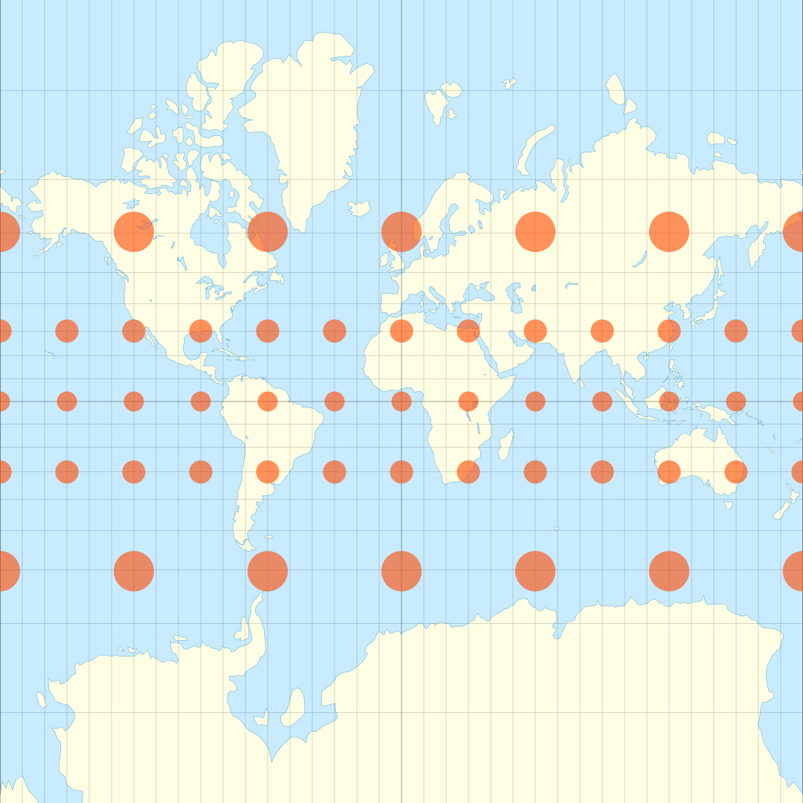
```

---

class: middle

```{r fig.width = 10, fig.height = 7, fig.cap = "Gall-Peters-projektionen."}
ggplot(world) +
  geom_sf(fill = "black", col = "white") +
  theme_minimal() +
  coord_sf(crs = "+proj=cea +lon_0=0 +lat_ts=45")
```

---

class: middle

```{r fig.width = 11, fig.height = 7, fig.cap = "Mollweide-projektionen."}
ggplot(world) +
  geom_sf(fill = "black", col = "white") +
  theme_minimal() +
  coord_sf(crs = "+proj=moll")
```

---

class: middle

```{r, fig.cap = "Waterman Butterfly-projektionen.", out.width = "95%", echo = FALSE}
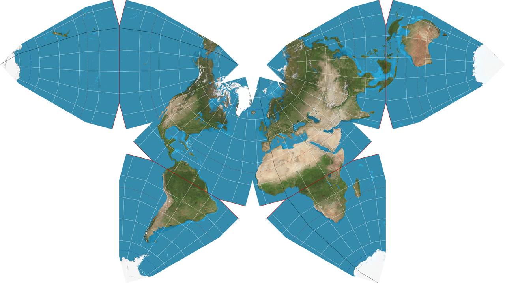
```

---

class: middle

```{r fig.width = 7, fig.height = 5, out.width = "45%"}
world <- map_data("world")

airports <- read_tsv(
  "https://slcladal.github.io/data/airports.txt",
  col_names = TRUE
)

ger_map <- filter(world, region == "Germany")
ger_air <- filter(airports,
                  Country == "Germany",
                  Longitude > 5, Latitude < 57)

p <- ggplot(
  ger_air,
  aes(Longitude, Latitude)
) +
  geom_polygon(
    aes(long,
        lat,
        group = group),
    inherit.aes = FALSE,
    fill = "gray",
    data = ger_map
  ) + coord_map() +
  theme_minimal()
p
```

---

class: middle

```{r fig.width = 7, fig.height = 5, out.width = "45%"}
p + geom_point()
```

---

class:middle

```{r fig.width = 7, fig.height = 5}
p +
  geom_density_2d_filled(alpha = 0.25) +
  geom_density_2d(col = 1) +
  geom_point()
```

---

## Animerade visualiseringar

väldigt effektivt för framförallt
presentationer

```{r, gganimate = list(duration = 30, fps = 20), dev = "png", fig.height = 6, fig.width = 11, res = 192}
library(rworldmap)

covid <- read_csv(
  "https://raw.githubusercontent.com/stat-lu/STAE04/master/data/covid.csv"
)

world <- map_data(getMap("coarse"))

library(lubridate)

covid2 <-
  covid %>%
  filter(indicator == "deaths") %>%
  mutate(deaths_weekly_prop = weekly_count/population * 100000) %>%
  group_by(region, year, month) %>%
  summarize(deaths = sum(deaths_weekly_prop)) %>%
  mutate(date = as.Date(paste(year, month, 1, sep = "/"), "%Y/%m/%d"))

covid_world <- inner_join(world, covid2, by = "region")

library(gganimate)

ggplot(covid_world, aes(long, lat, group = group)) +
  geom_polygon(aes(long, lat, group = group), fill = "light grey", data = world) +
  geom_polygon(aes(fill = deaths), show.legend = FALSE) +
  scale_fill_distiller(palette = "Reds", direction = 1) +
  coord_map("mollweide", xlim = c(-180, 180)) +
  transition_time(date) +
  theme_void() +
  labs(title = "Year: {year(frame_time)}, Month: {month(frame_time)}")
```

--

---

## Interaktiva visualiseringar

perfekta för hemsidor, men lämna inte över
jobbet helt åt läsaren!

```{r include = FALSE}
library(plotly)
p <- ggplot(msleep, aes(brainwt, sleep_total, color = vore,
                        genus = genus,
                        conservation = conservation)) +
  geom_point() +
  scale_x_log10()
p2 <- ggplotly(p)
htmlwidgets::saveWidget(as_widget(p2), file = "demo.html")
```

<iframe src="demo.html" width="80%" height="400" id="igraph" scrolling="no" seamless="seamless" frameBorder="0"></iframe>

---

class: section-title

# Learning by (bad) examples

---

### Exempel 1

```{r out.width = "70%"}
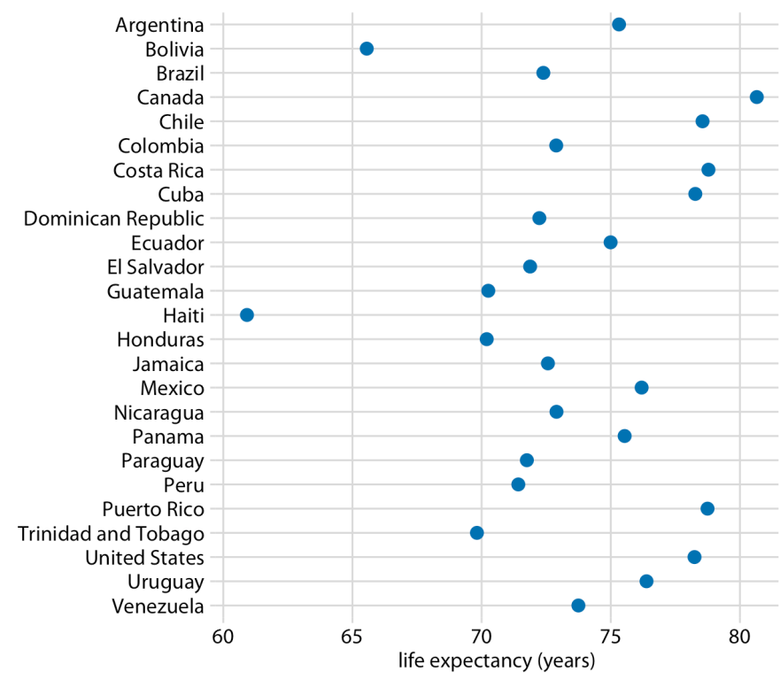
```

---

class: middle

```{r out.width = "70%"}
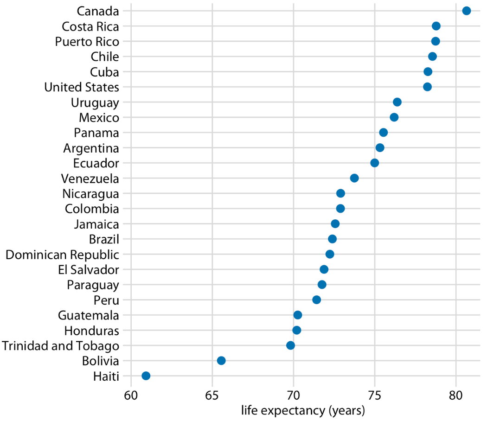
```

---

class: middle

### Exempel 2

```{r}
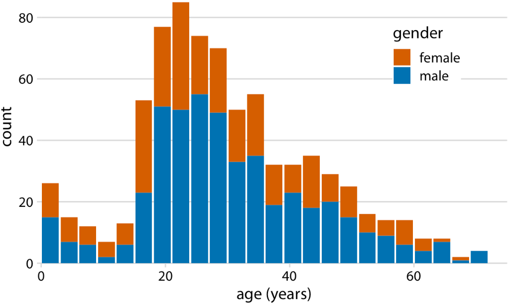
```

---

class: middle

```{r}
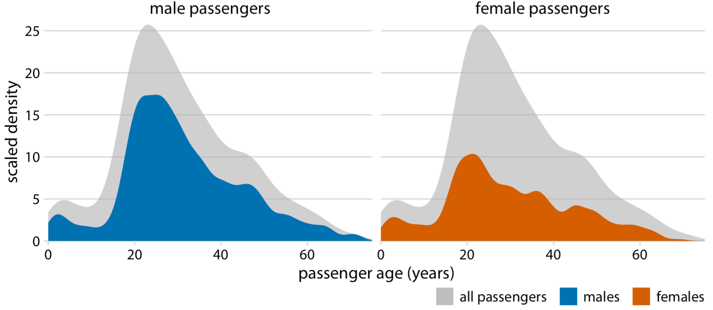
```

---


### Exempel 3

```{r out.width = "90%"}
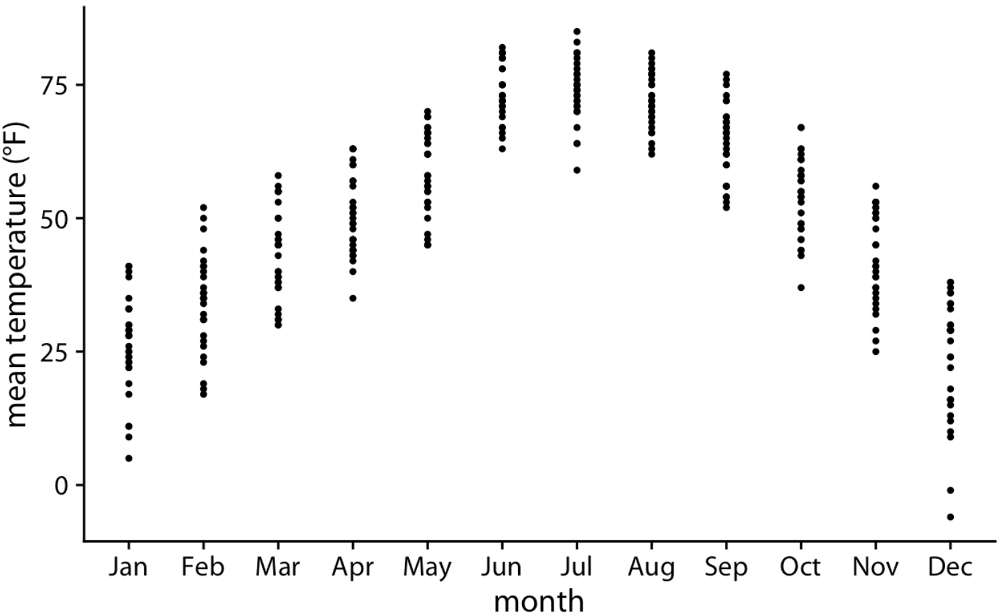
```

---

class: middle

```{r out.width = "90%"}
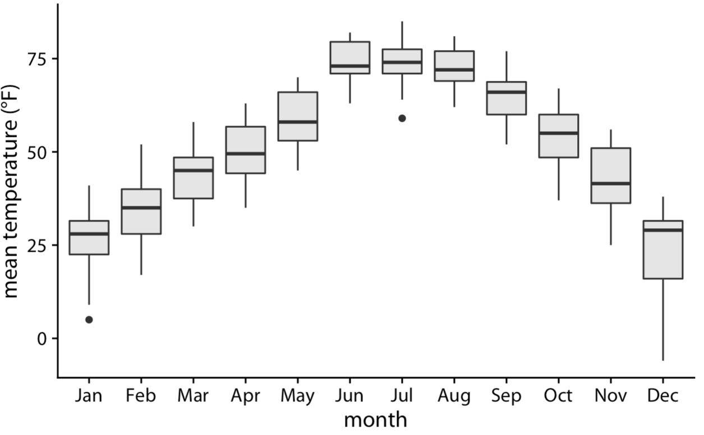
```

---

class: middle

### Exempel 4

```{r}
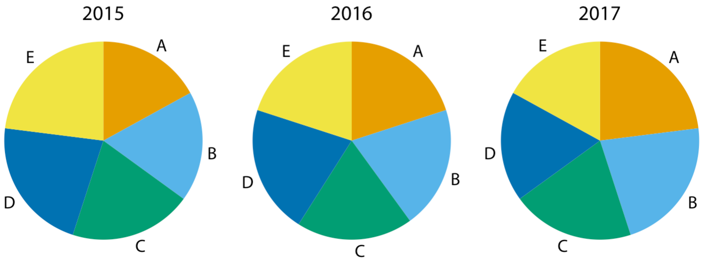
```

---

class: middle

```{r out.width = "90%"}
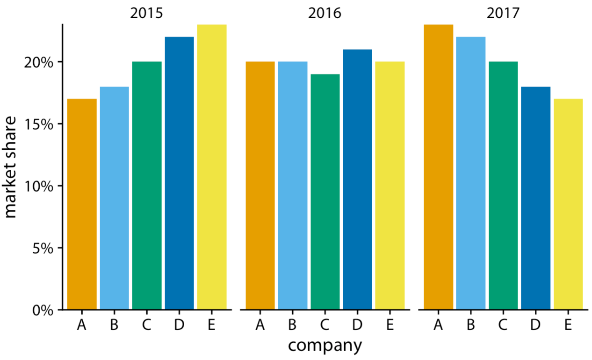
```

---

## Övning: designa en visualisering

Låt säga att ni har ett datamaterial över ett antal vetenskapliga rapporter
där huvudförfattaren är affilierad med ett universitet i Europa.
Ni har:

- typ av rapport (artikel, konferensbidrag, etc)
- namn på författarna
- affiliationer på författarna
- ID på andra artiklar som har citerat artikeln
- ID på artiklarna som artikeln har citerat
- publiceringsdatum
- tidskrift

### Uppgift

Skapa en visualisering för att titta på hur


---
class: center, middle

# Verktyg, resurser

---

## Verktyg

finns en uppsjö av olika verktyg för visualiseringar

.pull-left[
#### Programmering

* R (ggplot2)
* python (seaborne)

#### Grafiska gränssnitt

* Tableau
* Power BI
* Matlab

#### Nischade applikationer
* VOSviewer
]

.pull-right[
```{r out.width = "50%"}
knitr::include_graphics("images/ggplot2.png")
```

```{r out.width = "80%"}
knitr::include_graphics("images/tableau.jpg")
```

```{r}

```
]

---

## Literatur

.pull-left-60[
R. Grant, **Data visualization**: Charts, Maps, and Interactive Graphics, 1
edition. Boca Raton: Chapman and Hall/CRC, 2018. (Gratis via LU)
]

.pull-right-40[
```{r out.width = "60%"}
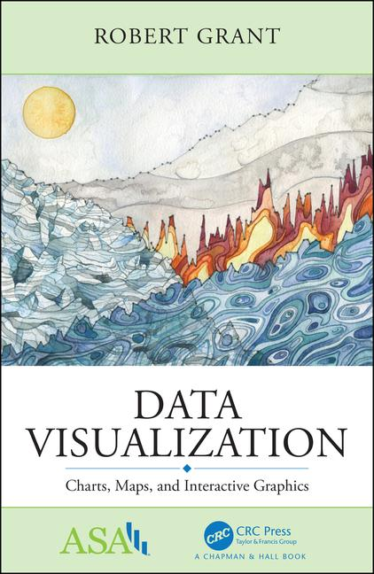
```
]

--

.pull-left-40[
```{r out.width = "60%"}
knitr::include_graphics("images/healy-book.jpg")
```
]

.pull-right-60[
K. Healy, **Data visualization: A Practical Introduction**, 1st edition.
Princeton, NJ: Princeton University Press, 2019. (Tillgänglig online:
[socviz.co](https://socviz.co/))
]

---

.pull-left-60[
C. O. Wilke, **Fundamentals of data visualization: a primer on making informative
and compelling figures**, 1st edition. Sebastopol, CA: O’Reilly Media, 2019.
(Tillgänglig online: [clauswilke.com/dataviz/](https://clauswilke.com/dataviz/))
]

.pull-right-40[
```{r out.width = "60%"}
knitr::include_graphics("images/wilke-book.png")
```
]

--

.pull-left-40[
```{r out.width = "60%"}
knitr::include_graphics("images/tufte-book.jpg")
```
]

.pull-right-60[
E. R. Tufte, **The visual display of quantitative information**, 2nd edition.
Cheshire, Conn: Graphics Press, 2001.
]

---

### STAE04: Visualisering av data

en introduktion till datavisualisering med R och ggplot2


läs mer på <https://stat.lu.se/utbildning/kurser/stae04_visualisering_av_data>

---

class: section-title

# Frågor? Tankar?


---

## Referenser

```{r, results = "asis", echo=FALSE}
PrintBibliography(bib)
```
